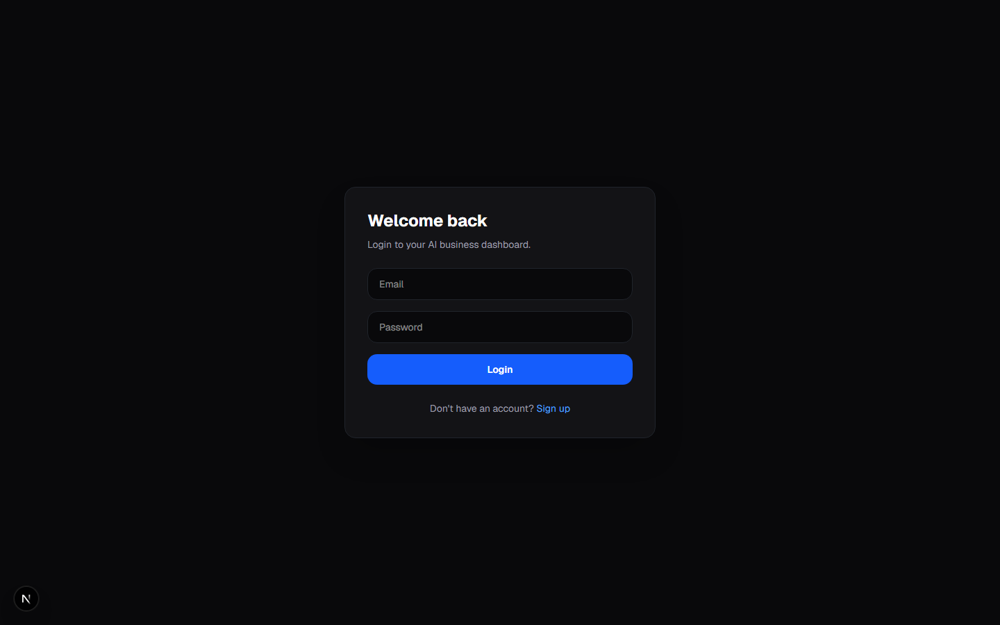
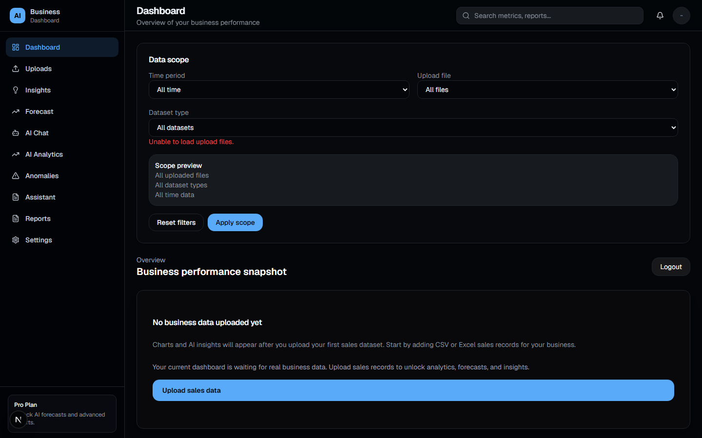
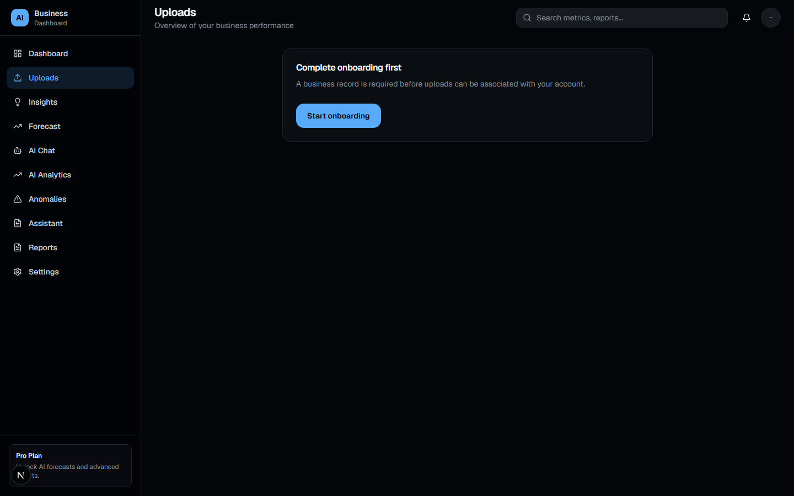
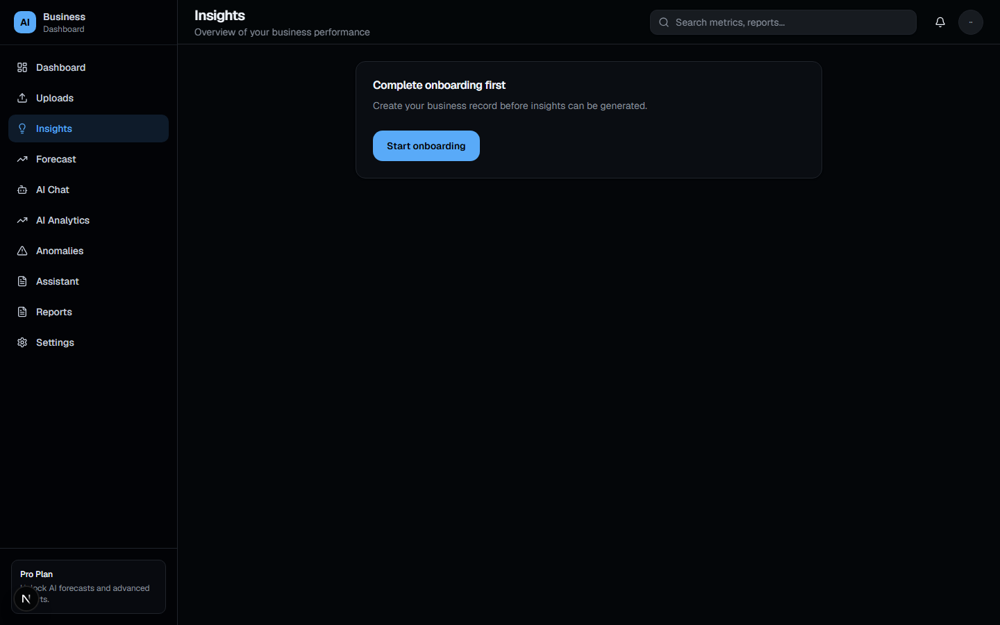
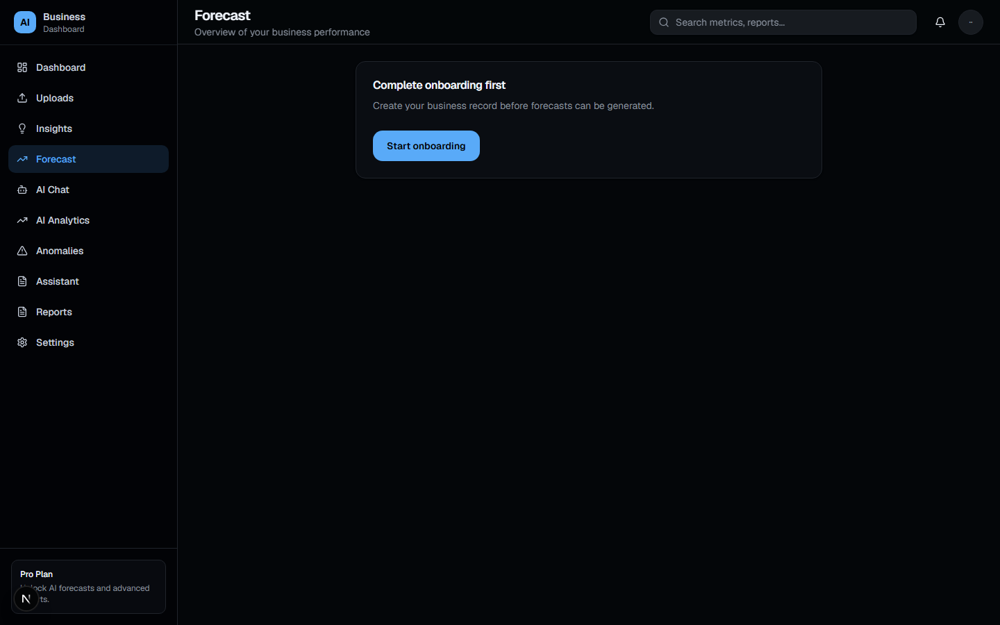

# AI Business Dashboard

An AI-powered business intelligence platform for small and medium enterprises. Upload your CSV or Excel sales, expense, inventory, and customer records — the dashboard generates real-time KPI metrics, revenue charts, profit forecasts, and Gemini-powered AI insights from your actual business data.

Built with Next.js 15 App Router, TypeScript, Tailwind CSS, Supabase, and Google Gemini.

## Screenshots

### Login


### Dashboard


### Uploads


### Insights


### Forecast


## Stack

- Next.js 15 (App Router)
- TypeScript
- Tailwind CSS v4
- shadcn/ui-style components
- lucide-react
- Recharts
- Supabase (auth + database)
- Google Gemini (AI insights)

## Getting Started

```bash
npm install
npm run dev
```

Copy `.env.example` to `.env.local` and fill in your Supabase and Gemini API keys.

Open [http://localhost:3000](http://localhost:3000) — you'll be redirected to `/dashboard`.

## Project Structure

```
app/                    # Routes (dashboard, uploads, insights, forecast, ai-chat, etc.)
components/
  layout/               # Sidebar, topbar, dashboard shell
  dashboard/            # Dashboard-specific UI & charts
  uploads/              # Upload dropzone and history
  insights/             # AI insights list
  forecast/             # Forecast charts and summary
  ai-chat/              # AI chat client
  ui/                   # Reusable UI primitives
lib/
  auth.ts               # requireUser() server helper
  data-scope.ts         # Data scoping/filtering logic
  supabase/             # Supabase client (browser + server)
  utils.ts              # Utilities (cn, formatters)
types/
  index.ts              # Shared TypeScript types
```

## Features

- Supabase authentication (login, signup, onboarding)
- CSV and Excel file uploads for sales, expenses, inventory, and customers
- Real-time KPI cards: revenue, expenses, profit, customer count
- Monthly revenue and profit charts (Recharts)
- AI-generated business insights via Google Gemini
- Revenue and expense forecasting
- AI chat assistant with business data context
- Anomaly detection
- Dark mode UI

## Scripts

- `npm run dev` — Start development server
- `npm run build` — Production build
- `npm run start` — Start production server
- `npm run lint` — Run ESLint
